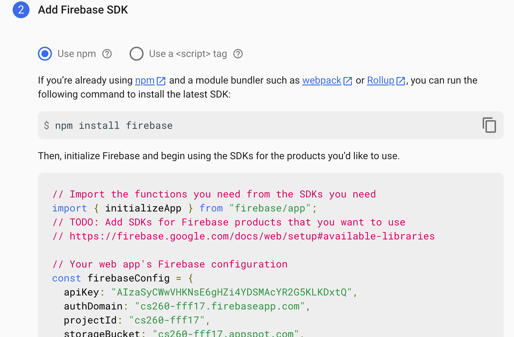
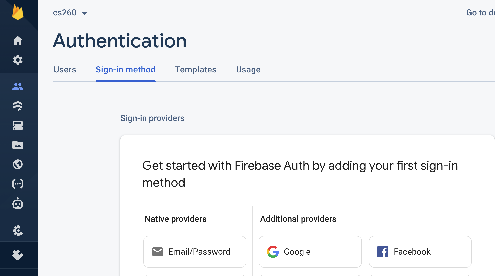
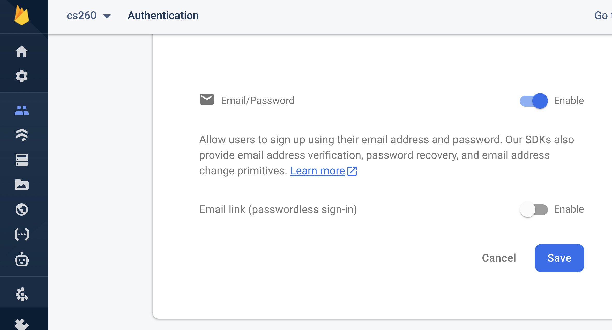
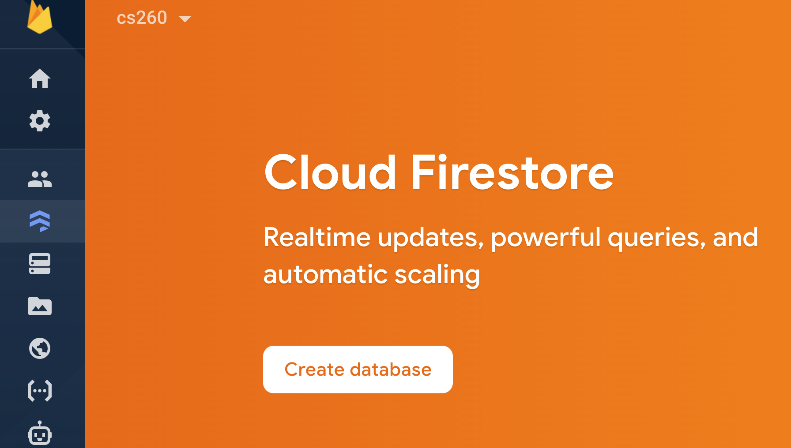
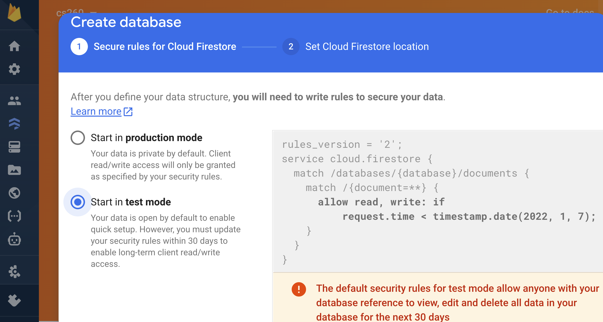

# firebase
This tutorial is intended to give you some basic information about how to use firebase authentication and the firestore database.
## Introduction
Firebase is a backend-as-a-service (BaaS) offering by Google that features databases, an ML kit, cloud functions, authentication, hosting, cloud storage, and more. Firebase abstracts the complexity of building a robust and scalable backend system, enabling developers to focus on building the client side of applications.
## Video
You can follow this [video](https://youtu.be/zL0dKETbCNE) to build a React application that will use firebase for authentication and database operations.  So, all you will have to do is host your front end on your Cloud9 server (But firebase will also host your front end if you want it to).  The following setup rules will be covered in the video, but this list may help you make sure you caught everything.  I had to fix a few things in his [github repository](https://github.com/machadop1407/react-firebase-blog-website.git), but you can use it for a reference.  You should clone this repository if you want to get to a working version.


## Firebase Setup

* Visit the Firebase console and sign in with your Google account
* Click “Add Project”
* Click “Continue” to create the project (we don’t need analytics)


* Click on the web icon </>
* For the app nickname, enter whatever name you want and click “Next”
* When your Firebase configuration is displayed, copy the contents within the scripts tag



* On the Console, select authentication and select 'Google'



* Notice that you could also choose to authenticate with passwords or Twitter or Facebook.
* Enable Google and save



* Now create a database



* And start the database in test mode



* And create a collection called "posts".  It will create an automatic document.  Delete the document so it doesnt confuse you.

* Now change the firestore rules to allow access
```
rules_version = '2';
service cloud.firestore {
  match /databases/{database}/documents {
    match /{document=**} {
      allow read, write: if true;
    }
  }
}
```
* And allow your domain to access the application.  Go to Authentication/Settings and scroll down to authorized domains.  Add the domain for your Cloud9 server.

* Clone this repository, install with npm and start it
```
npm install
npm start
```
